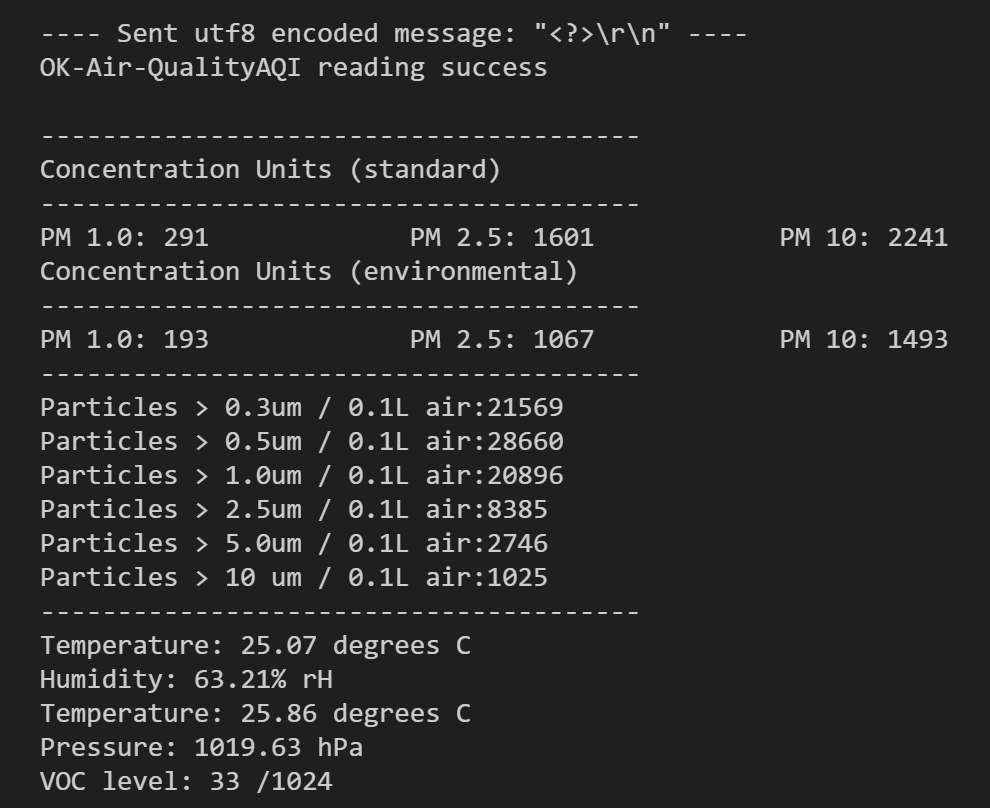

# Air Quality Monitor - Background

## Premise

Adapted from chemical engineering teaching modules from the University of Utah.

This is a device that should detect and report the composition of ambient air. It should report two to five parameters, including particulate matter, CO2, and for example, temperature, relative humidity, pressure, or volatile organic compound content.

**Commercial reference:** [IKEA VINDRIKTNING](https://www.ikea.com/us/en/p/vindriktning-air-quality-sensor-60515911/), https://www.amazon.com/dp/B0CTZW8QYG

## Chemical Engineering Principles

- Fundamentals (mass and energy balances, composition)
- Transport (convection, diffusion)
- Thermodynamics (temperature, pressure, humidity)

## Basis References

- https://www.che.utah.edu/teaching_module/arduino-air-quality-sensor/
- https://www.che.utah.edu/teaching_module/lego-air-quality-sensor/
- https://seetheair.org/2021/12/06/airgradient-diy-indoor-outdoor-air-quality-monitor/
- https://www.jeffgeerling.com/blog/2021/airgradient-diy-air-quality-monitor-co2-pm25
- https://magazine.scienceconnected.org/2020/07/building-diy-air-quality-monitors/

\newpage

# Prototype project devices

## Hands-on Skills

- Electronics: hardware, wiring, signal processing, communications
- Programming: Moderate C++ (Arduino), Libraries
- Fabrication: CAD, 3D printing

## Final prototype
{width=50%}

{width=50%}

- Particulate matter
- CO2, Temperature, Relative Humidity
- Temperature, Pressure
- VOC

**Prototype 1**

{width=50%}

- Particulate matter
- Temperature, Relative Humidity
- Temperature, Pressure
- VOC


\newpage

# Components

{width=50%}

## Hardware and electronics

1. Arduino UNO R3
1. USB-B Cable (printer cable, computer to Arduino)
1. 12 V power supply
    - Or stable voltage >= 5 V for analog reference
1. CAD files for Arduino UNO case
    - Arduino UNO 3D encasing
    - Middle support plate
       - To be designed and printed by you
1. Adafruit MiCS5524 - VOC sensor breakout board
1. Adafruit LPS22 - absolute pressure and temperature sensor breakout board
1. Adafruit PMSA003I - particulate matter sensor breakout board
1. **Prototype 1:** Adafruit HTS221 - temperature and relative humidity sensor breakout board
1. **Prototype 2:** Adafruit SCD-41 - CO2, temperature, and relative humidity sensor breakout board

## Tools and equipment

1. Cut/strip/crimp tool
1. Multimeter
1. 3D printer (FDM/FFF/Extrusion)
    - Not material-specific

## Consumables

1. 1x STEMMA QT / Qwiic JST SH 4-pin to Premium Male Headers Cable - 150mm Long (Adafruit No. 4209)
1. 2x STEMMA QT / Qwiic JST SH 4-Pin Cable - 50mm Long (Adafruit No. 4399)
1. Hook-up wire
1. Terminal connectors

## Software

### Computer

- Arduino IDE (2.3.2)
- VS Code (1.91.0)

### Firmware

- `project-air-quality/program/program.ino`  
    - Interfaces with hardware via Adafruit libraries. Includes logic for output to Arduino IDE Serial Plotter or peripheral-like communication protocol.
    - In Serial Plotter output mode, variables are printed in Arduino IDE Serial Plotter format. The total number of outputs may exceed plottable variables. In that case, comment out undesired variables.
    - In peripheral mode, query the device from a serial console with `<?>` to return a report of all relevant variables.

### Libraries

Available via the Arduino Library manager or Adafruit GitHub.

1. Adafruit PM25 AQI Sensor (Adafruit, 1.0.6)
1. Adafruit LPS2X (Adafruit, 2.0.4)
1. Adafruit HTS221 (Adafruit, 0.1.2)
1. Adafruit BusIO (Adafruit, 1.13.2)
1. Adafruit Unified Sensor (Adafruit, 1.1.6)
1. Sensirion I2C SCD4x (Sensirion, 0.4.0)
    - https://github.com/Sensirion/arduino-i2c-scd4x
    - _Dependency:_ Sensirion Core (Sensirion, 0.7.1)

### Extensions

VS Code

1. Serial Monitor (v0.11.0)
1. Arduino (v0.6.0)

# Procedure

## Computer setup

1. Install VS Code and Arduino IDE, or download zipped bundles (for use without admin privileges)
1. Install the libraries and extensions for Arduino and VS Code

## CAD

1. Download an Arduino case from Thingiverse, or use the version in   
    `project-air-quality/cad/arduino-case-original/Arduino UNO + Shield case + 40mm fan - 1765459.zip`.
1. Use Fusion360's reverse-engineering features to create a middle support plate for the sensor boards.
    - An existing version is included in this repository.

## Hardware

1. Slice and print the 3D files. No special settings are necessary.
    - Ensure the parts are oriented appropriately for printing (avoid unsupported areas, etc).
    - Pins may need to be resized, depending on print hardware and settings.
1. Attach the Arduino to the bottom case shell and secure with pins.
    - It may be necessary to use pliers to insert the pins.
    - It may be necessary to increase or reduce the pin diameter with tape, sanding, or other means.
1. Carefully remove the guards from the individual pins of the male-female JST connector. Connect the female end to one of the breakout boards.
1. Use the female-female JST connectors to link the breakout boards.
1. Solder or loop hook-up wire around the power, ground, and analog output connections of the MiCS VOC sensor.
1. Cut a short wire to connect the Arduino 5V to the boards on the middle support plate.
    - Fit and crimp a female quick-disconnect terminal to the power lead.
    - Repeat for a ground line.
1. Arrange the sensors on the middle support plate and secure with pins.
1. Pass the data lines (SDA, blue JST; SCL, yellow JST; and analog out, MiCS) through appropriate holes in the middle support plate.
1. Connect the data lines to the SDA, SCL, and A1 pins on the Arduino.
1. Connect the power and ground lines from the sensors to the respective quick-disconnect terminals.
1. Connect the power and ground lines to the 5V and GND pins on the Arduino.
1. Fit the middle support plate and top shell of the case.

{width=50%}

{width=50%}

## Firmware

1. Open `project-air-quality/program/program.ino` in your editor.
1. Comment/uncomment the appropriate section in `loop()`, depending on whether you intend to use the Arduino IDE Serial Plotter
    or the Serial Monitor in VS Code (or another console, such as PuTTY).
    - If using the Serial Plotter:  
        
            void loop() {
                // Use this when displaying the output via Arduino IDE Serial Plotter
                serialPlotter();
            }
        
    - If using a console:  
        
            void loop() {
            // Use this when communicating directly via console or serial monitor
                recvWithStartEndMarkers();
                if (newData == true) {
                    strcpy(tempChars, receivedChars);
                        // this temporary copy is necessary to protect the original data
                        //   because strtok() used in parseData() replaces the commas with \0
                    checkType();
                    newData = false;
                }
            }

1. Connect the Arduino to the computer and identify its serial port.
1. Upload `project-air-quality/program/program.ino` to the Arduino.

## Operation

### Arduino IDE Plotting

1. Connect the Arduino to an external power supply
1. Connect the Arduino to the computer
1. Open the Arduino IDE
1. Open the Serial Plotter
1. Select from the available variables using the checkboxes at the top of the window
    - If you need to show other variables, edit the Arduino program (sketch) by commenting out any undesired variables. Then re-upload the sketch

### Console communication

1. Connect the Arduino to an external power supply
1. Connect the Arduino to the computer
1. Open VS Code and the Serial Monitor 
    - Alternatively, use a serial console of your choice
1. Set the baud rate to the program parameter in `Serial.begin(XXX)`
1. Send the command `<?>` to query the program
    - The results will be printed to the console

# Output





Breathing with console output - all sensors:

```
---- Sent utf8 encoded message: "<?>" ----
OK-Air-Quality
AQI reading success

---------------------------------------
Concentration Units (standard)
---------------------------------------
PM 1.0: 0               PM 2.5: 0               PM 10: 0
Concentration Units (environmental)
---------------------------------------
PM 1.0: 0               PM 2.5: 0               PM 10: 0
---------------------------------------
Particles > 0.3um / 0.1L air:351
Particles > 0.5um / 0.1L air:88
Particles > 1.0um / 0.1L air:8
Particles > 2.5um / 0.1L air:0
Particles > 5.0um / 0.1L air:0
Particles > 10 um / 0.1L air:0
---------------------------------------
Temperature: 26.71 degrees C
Pressure: 1012.75 hPa
VOC level: 39 /1024

Co2:1235,scdTemperature:27.45,scdRelHumidity:44.15
---- Sent utf8 encoded message: "<?>" ----
OK-Air-Quality
AQI reading success

---------------------------------------
Concentration Units (standard)
---------------------------------------
PM 1.0: 1               PM 2.5: 2               PM 10: 2
Concentration Units (environmental)
---------------------------------------
PM 1.0: 1               PM 2.5: 2               PM 10: 2
---------------------------------------
Particles > 0.3um / 0.1L air:297
Particles > 0.5um / 0.1L air:85
Particles > 1.0um / 0.1L air:12
Particles > 2.5um / 0.1L air:2
Particles > 5.0um / 0.1L air:0
Particles > 10 um / 0.1L air:0
---------------------------------------
Temperature: 27.52 degrees C
Pressure: 1012.75 hPa
VOC level: 27 /1024

Co2:2834,scdTemperature:27.43,scdRelHumidity:55.77
```

# Troubleshooting

## My Arduino doesn't show anything in the serial monitor when I connect to it.

Check your baud rate (e.g. 9600 vs 115200). Choose the setting that matches the number in `Serial.begin(XXX);` of the Arduino program.

You should also check other communication settings that may have been changed for a specific device. When communicating with the Arduino, use the following settings:

- Data bits: 8
- Stop bits: 1
- Parity: None
- DTR: False
- RTS: False

These are generally the default settings for an application like the pyserial API, but they may not be set in VS Code or another console.

- https://pyserial.readthedocs.io/en/latest/pyserial_api.html

## My `<?>` command doesn't return any results.

Check the encoding (ASCII) of the message being transferred. As long as the message is sent within the brackets, line endings (outside of brackets) should not be interpreted.

## My analog reading is variable or nonsensical.

This can be caused by an unstable power supply to the Arduino. If the reference voltage is variable, the analog reading (taken in reference) will also be variable. This may occur if the device is powered by USB only. Connect an external power supply, try removing unnecessary peripherals from the Arduino power, or connect Vref to the supply voltage.

Alternatively, check whether the analog pin is used for another function. For example, you should not read off of pins A4 or A5 if also using I2C devices, like in this project.

- https://forum.arduino.cc/t/solved-using-i2c-and-analog-pins-at-the-same-time/186428
- https://docs.arduino.cc/learn/communication/wire/

If reading multiple analog signals, you may also run into problems with impedance. See the discussion here: 

1. https://blog.adafruit.com/2010/01/29/how-to-multiplex-analog-readings-what-can-go-wrong-with-high-impedance-sensors-and-how-to-fix-it/
    - troubleshooting high-impedance sensors, multiplexing analog signals

## I see nonsensical output when integrating the CO2 sensor from the manufacturer example.

The example provides error checking that seems to interfere with the output from other sensors. Simply start/stop readings from the sensor, and report the results read into the variables. Your judgement can be used to check errors of 0 CO2 reading or otherwise.

\newpage

# Alternative embodiments and extensions

## Prototype Iterations

{width=50%}

For the initial breadboard photosensor prototype, see `project-air-quality/elements/ptxstr`.

{width=50%}

For the prototype using a different Plantower sensor without I2C, which required SoftwareSerial communication, see `project-air-quality/elements/air-quality-1`.

See 

## LED or Laser

{width=50%}

This board can run directly from the 5V pin.

## DHT temperature/humidity sensor

{width=50%}

See the code in: `project-air-quality/elements/DHTester`.

### Hardware

1. DHT11 sensor module

### Libraries
1. DHT sensor library (Adafruit, 1.4.4)

### Reference

1. https://learn.adafruit.com/dht/using-a-dhtxx-sensor-with-arduino
    - adafruit project page for dht 11

## CO2 sensors

### Hardware
1. Adafruit SGP30 - VOC and eCO2 breakout board
1. Adafruit SCD41 - CO2, Temperature, Humidity breakout board
1. Adafruit SCD30 - CO2, Temperature, Humidity breakout board (NDIR)

## Project extensions

- Map a room with distributed PM sensors


\newpage

# References

## Datasheets, manuals, and source code

1. https://www.ncbi.nlm.nih.gov/pmc/articles/PMC10176080/pdf/main.pdf
    - paper: plantower sensor vs standards
1. https://cdn-shop.adafruit.com/product-files/4505/4505_PMSA003I_series_data_manual_English_V2.6.pdf
    - Manual/datasheet for Adafruit/plantower sensor PMSA003I
1. https://registry.platformio.org/libraries/adafruit/Adafruit%20Unified%20Sensor
    - source for adafruit unified sensor library
1. https://plantower.com/en/products_33/76.html
    - official plantower site for pms7003
1. https://download.kamami.pl/p564008-PMS7003%20series%20data%20manua_English_V2.5.pdf
    - manual for pms7003
1. https://cdn-shop.adafruit.com/product-files/4505/4505_PMSA003I_series_data_manual_English_V2.6.pdf
    - manual for pmsa003i
1. https://www.adafruit.com/product/3686
    - adafruit pms5003
1. https://learn.adafruit.com/pm25-air-quality-sensor/arduino-code
    - adafruit project page - wiring, code
1. https://learn.adafruit.com/pm25-air-quality-sensor/downloads
    - manual for pms5003
1. https://forums.adafruit.com/viewtopic.php?f=48&t=136528&p=767725#p767725
    - forum discussion page on plantower sensor
1. https://cdn-shop.adafruit.com/product-files/3686/plantower-pms5003-manual_v2-3.pdf
    - manual for pms5003
1. https://github.com/adafruit/Adafruit_PM25AQI/blob/master/examples/PM25_test/PM25_test.ino
    - github source for plantower sensor code
1. https://adafruit.github.io/Adafruit_PM25AQI/html/class_adafruit___p_m25_a_q_i.html
    - docs for adafruit plantower sensor library
1. https://cdn-shop.adafruit.com/product-files/3199/MiCS-5524.pdf
    - mics datasheet
1. https://learn.adafruit.com/adafruit-hts221-temperature-humidity-sensor/arduino
    - adafruit temp/rh breakout board docs
1. https://github.com/adafruit/Adafruit_HTS221
    - adafruit temp/rh library source
1. https://github.com/adafruit/Adafruit-HTS221-PCB?tab=readme-ov-file
    - temp/rh board pcb source

## Arduino

1. https://www.sparkfun.com/products/15443
    - Alternative board
1. https://www.arduino.cc/reference/en/language/functions/analog-io/analogread/
    - arduino analogread docs
1. https://docs.arduino.cc/learn/communication/wire/
    - arduino docs on serial communication (wire)
1. https://docs.arduino.cc/learn/built-in-libraries/software-serial/
    - arduino software serial library
1. https://forum.arduino.cc/t/tx-rx-vs-scl-sda/662500/4
    - arduino forum on serial vs i2c
1. https://forum.arduino.cc/t/softwareserial-vs-hardwareserial/1019212/5
    - arduino post on hardware vs software serial
1. https://docs.arduino.cc/learn/communication/uart/
    - arduino docs on serial protocol (tx/rx)
    - basis of Serial.print
    - device-to-device
1. https://forum.arduino.cc/t/uart-vs-tx-rx-vs-serial-print-vs-softwareserial/934159
    - arduino forum post on different types of communication

## Electronics

1. https://www.adafruit.com/product/4632
    - Adafruit I2C air quality sensor
1. https://www.adafruit.com/product/4505
    - Adafruit air quality sensor standalone (I2C capable)
1. https://www.nwengineeringllc.com/article/phototransistor-vs-photodiode-which-detector-is-best.php#:~:text=Photodiodes%20have%20similar%20structure%20as,or%20as%20an%20FET%20transistor.
    - phototransistor vs photodiode
1. https://learn.adafruit.com/introducing-adafruit-stemma-qt
    - adafruit stemma JST standard

## Project-specific

1. https://docs.google.com/document/d/1t4xgtNfliK3wB7jktAfM6fJsPSB45DLHkZabPNgI77Q/edit
    - Utah LEGO air quality sensor. Simple photosensor example
1. https://en.wikipedia.org/wiki/Voltage_divider
    - Principle of photoresistor circuit
1. https://projecthub.arduino.cc/tropicalbean/how-to-use-a-photoresistor-1143fd
    - Arduino project on using photoresistor. Parts, schematic, and code
1. https://blog.amerlux.com/4-things-architects-should-know-about-lumens-vs-perceived-brightness/
    - Mapping output LED brightness to human visual processing
1. https://www.youtube.com/watch?v=QgO0iWpK7Ho
    - plantower sensor teardown
1. https://www.reddit.com/r/adafruit/comments/111hzv8/pms5003_vs_pmsa003i_air_quality_sensors/
    - reddit plantower part numbers. I means I2C
1. https://www.reddit.com/r/meshtastic/comments/1czctrm/pmsa003i_air_quality_sensor/
    - reddit users of sensor
1. https://www.reddit.com/r/adafruit/comments/u54g38/problem_with_pmsa003i_air_quality_sensor/
    - reddit troubleshooting sensor
1. https://store.mcci.com/products/pms7003-prototyping-kit
    - supplier for pms7003
1. https://www.grainger.com/category/safety/gas-detection/portable-gas-detection/portable-gas-detector-calibration?attrs=Gas+Type%7CNitrogen&filters=attrs&searchQuery=Calibration+Gas&sst=4&tv_optin=true
    - calibration gas sourcing for project

## Open-source projects

1. **canar.io** -- based on Sensiron SCD30
    - https://canair.io/
    - https://canair.io/docs/
    - https://canair.io/docs/canairio_co2.html
1. https://howtomechatronics.com/projects/diy-air-quality-monitor-pm2-5-co2-voc-ozone-temp-hum-arduino-meter/
    - Online tutorial using plantower sensor. Schematics, custom PCB
1. https://www.instructables.com/How-to-Build-a-Portable-Accurate-Low-Cost-Open-Sou/
    - alternative embodiment - UC Berkley particle sensor
1. https://www.epa.gov/sites/default/files/2014-12/documents/sensor-kit-instructions.pdf
    - alternative embodiment (crude breadboard/arduino/sensor)

## Commercial devices

1. https://hackaday.com/2023/02/18/anatomy-of-a-fake-co2-sensor/
    - Consumer teardown of cheap CO2 sensor
1. https://iotnvr.com/products/rs485-modbus-air-quality-sensor
    - Industrial sensor. RS485 Modbus RTU
1. https://tsi.com/products/cleanroom-particle-counters/handheld-particle-counters/aerotrak-handheld-particle-counter-9306/
    - tsi site on particle counter (possible control)
1. https://www.tequipment.net/TSI/9306-V2/Particle-Counter/
    - purchasing handheld particle counter

## Project extensions

1. https://forum.arduino.cc/t/constant-current-hot-wire-anemometer/434057
    - arduino forum discussion on building a hot wire anemometer
1. https://www.digikey.com/en/products/detail/sparkfun-electronics/KIT-21310/18635170
    - air velocity sensor with eval board kit
    - https://www.sparkfun.com/products/21310
1. https://www.sparkfun.com/products/18768
    - sparkfun air velocity sensor breakout board
1. https://www.digikey.com/en/products/detail/renesas-electronics-corporation/FS1015-1015/12759202
    - renesas air velocity sensor (FS1015-1015)
1. https://www.digikey.com/en/products/detail/renesas-electronics-corporation/FS2012-1100-NG/7645220
    - renesas air velocity sensor (FS2012-1100-NG)
1. https://www.mouser.com/new/renesas/renesas-fs3000-air-velocity-sensor-module/
    - renesas air velocity sensor data (FS3000)
    - https://www.digikey.com/en/products/detail/renesas-electronics-corporation/FS3000-1005/12755097
1. 1. https://www.youtube.com/watch?v=SwrXruuCTpY
    - sparkfun renesas air velocity sensor
1. https://www.youtube.com/watch?v=nUUYXh7yUsw
    - adafruit renesas air velocity sensor FS1015
1. https://www.renesas.com/us/en/products/sensor-products/flow-sensors/fs1012-gas-or-liquid-flow-sensor-module
    - renesas site: flow sensor
1. https://www.renesas.com/us/en/products/sensor-products/flow-sensors/fs2012-gas-or-liquid-flow-sensor-module-calibration
    - renesas site: flow sensor (another module, calibrated)

### Other sensor types

1. https://wiki.seeedstudio.com/Grove-Air_Quality_Sensor_v1.3/
    - Grove "brand" sensor - VOCs
1. https://www.adafruit.com/product/5606
    - adafruit mox sensor
1. https://store-usa.arduino.cc/products/gravity-analog-co2-gas-sensor-mg-811-sensor
    - arduino-sponsored gravity(brand) co2 sensor
1. https://www.adafruit.com/product/4535
    - adafruit product page for temp/rh
1. https://www.adafruit.com/product/4633
    - product page for pressure sensor
1. https://www.adafruit.com/product/3965
    - product page for pressure sensor with port attachment (no quick connect)
1. https://atlas-scientific.com/blog/co2-sensor-arduino/
    - sensor supplier (US)
    - co2 sensor arduino (NDIR, UART)
