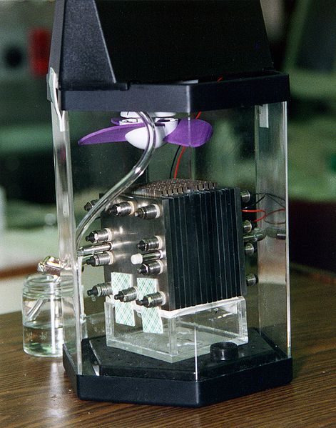

# Methanol Fuel Cell - Description
The Methanol Fuel Cell prototype is able to generate electrical power from feed streams of air and methanol fed to a fuel cell stack. The device adjusts methanol and air flow rates to maintain power output that is directed to a power bank using USB connectors. Builders will gain experience with chemical processes, electrochemistry, calibration, coding in python, and likely 3D printing. Further extensions could include engineering membrane electrode assemblies, cost performance optimization, etc.

# Methanol Fuel Cell - Background

A methanol fuel cell generates electricity from feed streams of methanol and oxygen (here, air). Under acidic conditions, this occurs by anodic oxidation of methanol to yield protons that flow through a proton exchange membrane where they reduce oxygen to water at the anode. The half cell reactions are shown below

Anode: $$\ce{CH3OH + H2O -> 6H+ + 6e- + CO2}$$

Cathode: $$\ce{3/2 O2 + 6H+ + 6e- -> 3H2O}$$

## Chemical Engineering Principles

- Fundamentals (mass and energy balances)
- Electrochemistry
- Transport (mass transfer)
- Kinetics

## Basic References

# Equipment and Reagents

## Components
> Many components are available from [The Fuel Cell Store](https://www.fuelcellstore.com/).

## Consumables
> **Note:** Many of the required items (chemicals in particular) are available from several vendors, including Sigma-Aldrich.

- **Methanol** (1L minimum, recommend at least 2L)  
---

## Hardware
- **Personal computer** with USB 2 or 3 connection available.

---

## Software

### Python
- Code is written in Python to operate the potentiostat, but it is also usable via a web app or a program installed on your computer.  
  Instructions: [Rodeostat Installation](https://blog.iorodeo.com/rodeostat-software/).

